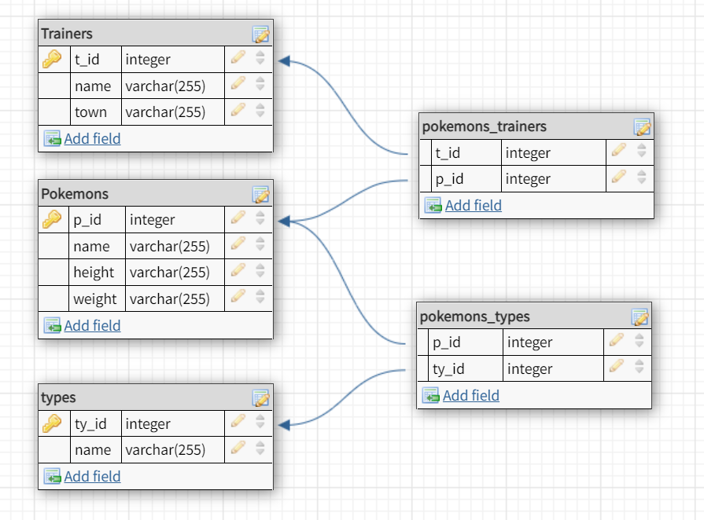

# Pokemon Tracker

## Introduction

- In this project we created a server for managing pokemons and trainers data. The server API documentation described below.
- In addition, we built a DB to contain all the data of the trainers and pokemons and it's relations.
  The DB architecture described below.
- We used external API https://pokeapi.co/ to get the types of pokemons and to get the evolution chain.

## Running instructions

### Initialize the DB

1. run `createDB.sql`
   which creates the poke_tracker DB.

2. run `create_tables.sql`
   which creates the following tables inside poke_tracker DB:

   - pokemons
   - trainers
   - types

3. run `create_pokemons_trainers_table.sql`
   which creates the table "pokemons_trainers" inside poke_tracker DB.

4. run `create_pokemons_types_table.sql`
   which creates the table "pokemons_trainers" inside poke_tracker DB.

5. run `initialize_tables.py`
   which inserts the data from "DB/utils/poke_data.json" to the tables.

### Run the server

1. run `server.py`
   which run the server on port 8000

2. go to http://localhost:8000 and start using the pokemonAPI.

## Pokemon API Documentation

`POST /pokemons`

request body: pokemon details: name, height, weight.
this route will add a pokemon to the DB, and get it's types from the external API and add it to the types table.

`GET /pokemons/{name}`

return pokemon data by it's name.

`GET /trainers`

query params: pokemon_name, trainer_id, trainer_name
this endpoint allows to return trainers according to some filters. for example trainers which has Pikatchu, or trainers with specific name etc.

`POST /trainers`

request body: trainer data: name, town
adds a trainer to the DB.

`DELETE /pokemons/{p_name}/trainers/{t_name}`

removes a given pokemon from specific trainer

`GET /pokemons`

query params: trainer_name, pokemon_type
allows to filter pokemons by trainer or by type or both.

`PUT /evolve/trainers/{t_name}/pokemons/{p_name}`

evolve specific pokemon of specific trainer, according to the pokeAPI evolution chain.

## DB Architecture

